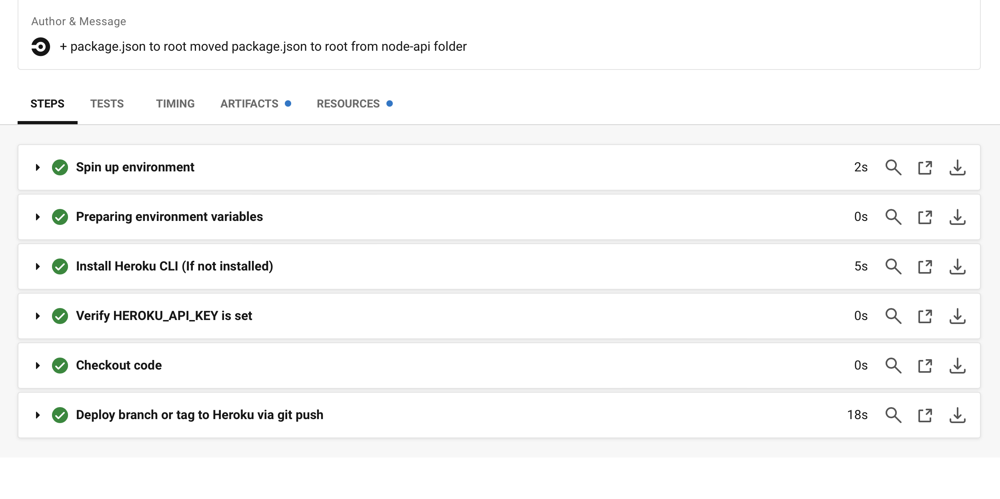

# CircleCI
- CircleCI is a continuous integration & delivery platform.
- It helps with automating the build, test, and deployment.
<h3 align="center">A screenshot of what successful build and launch will look like in circleci</h3>
 

 

 

## How CircleCI works?
- After a repository on GitHub are authorized and added as a project to circleci.com, with every code triggers CircleCI runs jobs. 
- CircleCI also sends an email notification of success or failure after the tests complete.
- This project shows the use of CircleCI orbs to continuously deploy a Node.js application to Heroku.

## Continuous deployment of Node app to Heroku
- CircleCI orbs are:
    - reusable packages of YAML configuration that condense repeated pieces of config into a single line of code. 
    - used to integrate services seamlessly into continuous integration pipelines.
    - used to continuously deploy a Node.js application to Heroku.

## Dependencies:
  - Node.js installed on your system
  - Git installed on your system
  - A Heroku account
  - A GitHub account

### Footnote

>Reference[^1]. 

>[^1]: circleci Blog/Fikayo Adepoju/Continuous deployment of Node apps to Heroku.

